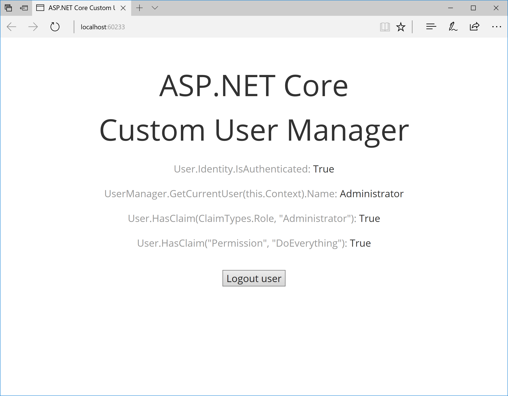

# ASP.NET Core Custom User Manager
This is a demo web application for the
“[ASP.NET Core Custom User Manager](https://medium.com/@dmitrysikorsky/asp-net-core-custom-user-manager-a7206e718a90)”
post on the [Dmitry Sikorsky’s blog](https://medium.com/@dmitrysikorsky). It demonstrates how to build custom
user manager on ASP.NET Core if you don’t want to use Identity.

The result looks like this:

*Custom ASP.NET Core user manager*

Updated to use .NET Core 6.

## Using the Application

1. Run the application.
2. Click Login user button.
3. Click Logout user button.
